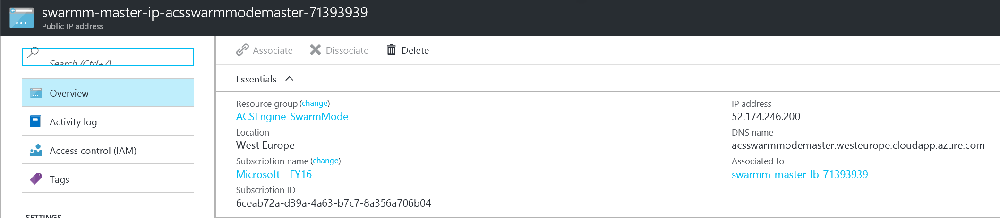
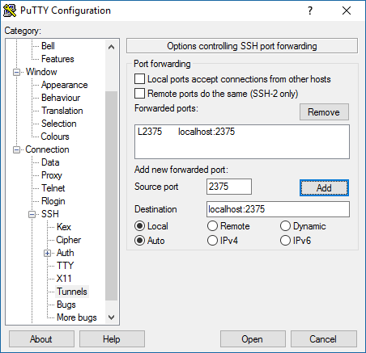

Conectar con un clúster de Azure Container Service con Docker Swarm
===================================================================
Los clústeres con Docker Swarm desplegados en Azure Container Service exponen endpoints REST, pero estos no están abiertos por defecto. Para poder administrar estos endpoints, tienes que crear un túnel SSH. Una vez el túnel SSH ha sido establecido, puedes ejecutar comandos contra los endpoints del clúster. Esta documentación muestra cómo crear un túnel SSH para Linux, OS X y Windows.

Obtener dirección IP y nombre de DNS
------------------------------------
Lo primero que debes es localizar el nombre de DNS público del Load Balancer para las instancias master. Para hacer esto, expande el grupo de recursos en el cual los recursos (ACS) ha sido desplegado. Localiza y selecciona la dirección IP pública del master. Esto te abrirá una ventana que contiene la información acerca de la dirección IP pública, que incluye el nombre de DNS. Guarda esta información para usarla después:



Crear un túnel SSH en Linux u OS X
----------------------------------
Para abrir un túnel SSH en Linux y OS X, abre una Shell y ejecuta el siguiente
comando donde:
-   **USERNAME** es el nombre de usuario que utilizaste al desplegar el clúster.
-   **DNSNAME** es el nombre DNS que aparece en la IP pública anterior.
-   **PRIVATEKEY** [opcional] es la ruta a la clave privada que corresponde a la clave pública que utilizaste al desplegar el clúster.
```
ssh -L 2375:localhost:2375 -f -N [USERNAME]\@[DNSNAME] -p 2200
```

Crear un túnel SSH en Windows
-----------------------------
Hay muchas maneras de establecer un túnel SSH en Windows. Puedes utilizar [Bash on Ubuntu on Windows](https://msdn.microsoft.com/es-es/commandline/wsl/about) y utilizar las instrucciones anteriores, o utilizar [PuTTY](http://www.putty.org/) como se muestra a continuación.

Abre PuTTY e introduce la siguiente información:
-   Host Name: [USERNAME]\@[DNSNAME].
    -   **USERNAME** es el nombre de usuario que utilizaste al desplegar el clúster.
    -   **DNSNAME** es el nombre DNS que aparece en la IP pública anterior.
-   Port: 2200


Selecciona SSH y Auth. Añade la localización de tu clave privada para la
autenticación.


Selecciona Tunnels y configura el siguiente reenvío:
-   Source port: 2375
-   Destination: localhost:2375
Pulsa sobre Add.



Cuando acabes, salva la configuración en Sessions y abre la conexión.
