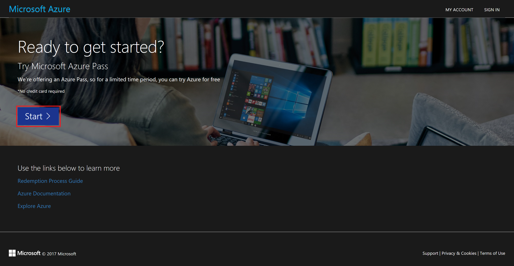
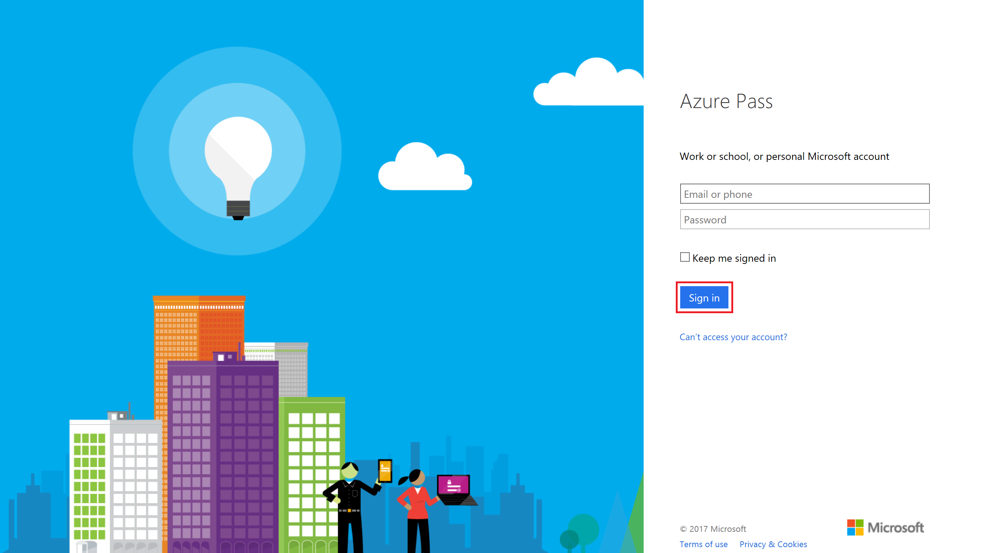
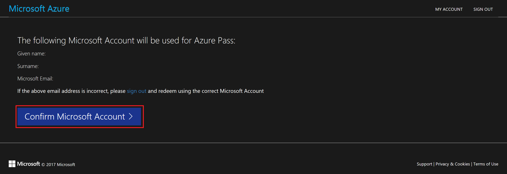
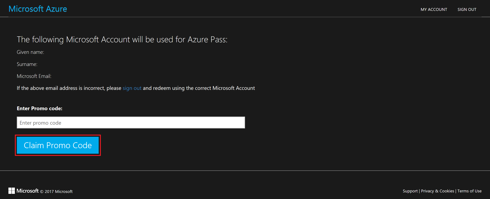

Activación de Microsoft Azure Pass
===============================

Para poder realizar la activación de la suscripción de Microsoft Azure Pass, ha
de seguir los siguientes pasos. Para ello ha de utilizar el código que le habrá
sido enviado y una cuenta Microsoft (Outlook, Hotmail, Live…) u Office 365 que no haya
utilizado anteriormente esta promoción u otras similares (Azure Grants, Azure
Pass…).

Portal de activación 
---------------------

Para poder activar la suscripción, ha de acceder a
<http://microsoftazurepass.com> y pulsar el botón "Start".

El siguiente paso es introducir la cuenta con la cual se asociará la suscripción
de Microsoft Azure. Para ello debe utilizar una cuenta Microsoft (Outlook, Hotmail, Live…) u Office 365.

Una vez iniciada la sesión, le aparecerá una ventana con sus datos para
comprobarlos y la opción de confirmarlos con el botón “Confirm Microsoft Account”. Púlselo e introduzca el código que le han facilitado.

Para finalizar el proceso, simplemente pulse el botón "Claim Promo Code". En estos momentos comenzará a crearse la subscripción y recibirá un correo electrónico cuando este lista.

Una vez recibido el correo electrónico, ya estará activada su suscripción de
Microsoft Azure, y podrá acceder a ella a través de
[https://portal.azure.com/](https://portal.azure.com/signin/index/?cdnIndex=4&l=en.en-us)
con las credenciales utilizadas en los pasos anteriores.

